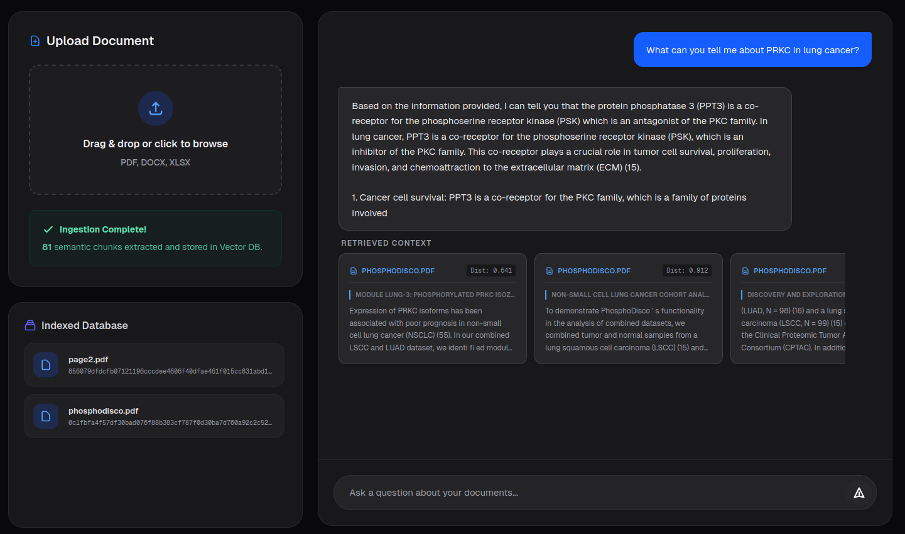

## Getting Started

First, run the frontend server:

```bash
pnpm dev
```

Then run the backend server:

```bash
cd backend
sudo sh docker_build.sh
sudo sh docker_start.sh
```
Open [http://localhost:3000](http://localhost:3000) with your browser to see the app.
You can upload PDFs and ask questions about them. 

